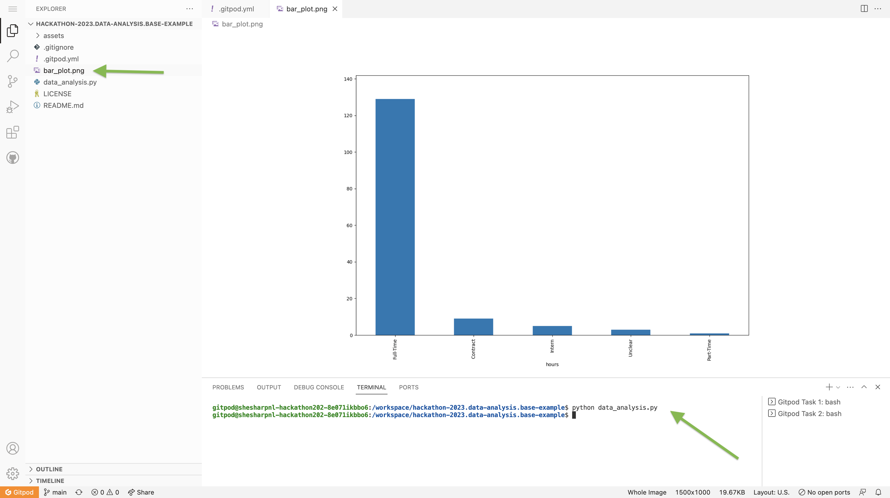

# hackathon-2023.data-analysis.base-example

This project utilizes [Python](https://www.python.org/), [Pandas](https://pandas.pydata.org/), and [Gitpod](https://www.gitpod.io/) for data analysis of job data available in CSV format.

Pandas is a powerful data manipulation and analysis library for Python. It provides data structures and functions to efficiently handle and analyze structured data.

With Gitpod, you can easily set up the project environment and start using these libraries for your data analysis.

## Table of Contents

- [Introduction](#introduction)
- [Prerequisites](#prerequisites)
- [Installation](#installation)
- [Usage](#usage)
- [How this project works](#how-this-project-works)
   - [Gitpod workspace](#gitpod-workspace)
   - [Python script](#python-script)
- [Contributing](#contributing)
- [Credits](#credits)
- [License](#license)

## `hackathon-2023.data-analysis.base-example`

### Introduction

This project utilizes Python, Pandas, and Gitpod for data analysis of job data available in CSV format. Pand

## Prerequisites

Before getting started, make sure you have the following prerequisites:

- **Git**: Git is a version control system that allows you to track changes in your code and collaborate with others. If you don't have Git installed, you can download and install it from the official website: [Git Downloads](https://git-scm.com/downloads).
- **Gitpod account**: Gitpod is an online integrated development environment (IDE) that makes it easy to set up and work on projects without the need to install any software locally on your computer. With Gitpod, you can quickly start coding in a fully-featured development environment right from your web browser. To get started, you'll need to sign up for a free Gitpod account on the Gitpod website: [Gitpod Sign Up](https://www.gitpod.io/)

Once you have Git and a Gitpod account set up, you'll be ready to fork and work on projects using Gitpod's online IDE.

## Installation

To start using this project in Gitpod, follow these steps:

1. Fork the repository by clicking the "Fork" button in the top right corner of the repository page. This creates a copy of the repository in your GitHub account.

2. Click the following link to open this repository in Gitpod: [Open in Gitpod](https://gitpod.io/#https://github.com/shesharpnl/hackathon-2023.data-analysis.base-example)

3. Gitpod will open the project in a new workspace, providing you with an integrated development environment (IDE) for writing and running code.

## Usage

To use the Pandas and Matplotlib libraries for data analysis, follow these steps:

1. Open the `data_analysis.py` file in the IDE interface provided by Gitpod. You can find it in the project files: "Explorer" section (top right of the IDE).

2. In the Gitpod terminal, execute the `data_analysis.py` script using the following command:

   ```bash
   python data_analysis.py
   ```

3. The script will generate a bar plot based on the provided CSV data and save it as `bar_plot.png`. A "plot" is a visual representation of data using a specific chart or graph type.

4. You can view the generated plot by clicking on the "Preview" button in the top right corner of the Gitpod IDE. The plot will be displayed in the Gitpod preview.

5. Feel free to explore and modify the code to perform additional data analysis tasks using Pandas and Matplotlib.



## How this project works

- [Gitpod workspace](#gitpod-workspace)
- [Python script](#python-script)

### Gitpod workspace

The `.gitpod.yml` file is used to configure your Gitpod development environment and automate certain tasks.

#### `image: python:3.9`
This line specifies the base image for your Gitpod workspace. It means that your development environment will be based on the Python 3.9 version.

#### `tasks` section
This section allows you to define tasks that will be executed when your Gitpod workspace is created. In this case, there is only one task:

- `command: "pip install pandas matplotlib"`: This task runs a command to install the required packages `pandas` and `matplotlib` using `pip`, which is the package manager for Python. These packages are commonly used for data analysis and plotting in Python.

#### `vscode` section
This section is used to configure the Visual Studio Code (VS Code) editor in your Gitpod workspace. It allows you to specify extensions that will be installed and activated when you open your workspace in Gitpod. In this case:

- `extensions: - ms-python.python`: This line specifies the extension `ms-python.python`, which provides Python language support in VS Code.

#### `ports` section
This section is used to specify which ports should be exposed in your Gitpod workspace, allowing you to access services running on those ports. In this case:

- `port: 8000`: This line specifies that port `8000` should be exposed. This means that any program running in your Gitpod workspace that listens on port 8000 can receive network traffic from outside the workspace. 
- `onOpen: open-preview`: This line indicates that a preview should be automatically opened in Gitpod when port `8000` is opened. 

Overall, this `.gitpod.yml` file sets up a Python 3.9 environment, installs the required packages (`pandas` and `matplotlib`), configures VS Code with the Python extension, and exposes port `8000`.

### Python script

The `data_analysis.py` file performs some basic data analysis and visualization tasks on the CSV file `assets/sourcestack-data-id_bcu86flyul.csv` located in this repository.

1. Importing libraries:
   - `pandas` is imported as `pd` to handle data manipulation and analysis.
   - `matplotlib.pyplot` is imported as `plt` to create visualizations.

2. Reading the CSV file:
   - The code reads a CSV file named `'assets/sourcestack-data-id_bcu86flyul.csv'` using the `pd.read_csv()` function.

3. Creating a new figure:
   - A new figure with a size of 15x10 inches is created using `plt.figure(figsize=(15, 10))`.

4. Generating a bar plot:
   - The code counts the occurrences of each value in the 'hours' column of the DataFrame (`df['hours']`) using `value_counts()`.
   - The result is plotted as a bar plot using `df['hours'].value_counts().plot(kind='bar')`.

5. Rotating x-axis labels:
   - The x-axis labels of the bar plot are rotated by 90 degrees for better readability using `ax.set_xticklabels(ax.get_xticklabels(), rotation=90)`.

6. Adding margins to the plot:
   - A margin of 0.1 is added to the plot to prevent the labels from being cut off using `plt.margins(0.1)`.

7. Saving the plot as a PNG image:
   - The plot is saved as a PNG image file named `'bar_plot.png'` using `plt.savefig(image_path)`.

8. Script completion message:
   - After all the tasks are completed, a message is printed to indicate that the script execution is completed.

This script essentially reads a CSV file, creates a bar plot of the values in the 'hours' column, and saves the plot as a PNG image file named `'bar_plot.png'`. Throughout the script, print statements are used to provide information about the progress of each step.

## Contributing

Contributions to this project are welcome! If you find a bug, have a feature request, or want to contribute code, please follow these guidelines:

1. Fork the repository and clone it to your local machine.
2. Create a new branch for your changes: `git checkout -b my-branch-name`
3. Make your changes, and test them thoroughly.
4. Commit your changes with a descriptive commit message.
5. Push your changes to your forked repository: `git push origin my-branch-name`
6. Open a pull request against the main branch of this repository, explaining the changes you've made and why they are important.

Thank you for your contributions!

## Credits

The job data has been retrieved using [SourceStack](https://sourcestack.co).

## License

This project is licensed under the Apache License 2.0 - see the [LICENSE](LICENSE) file for details.

